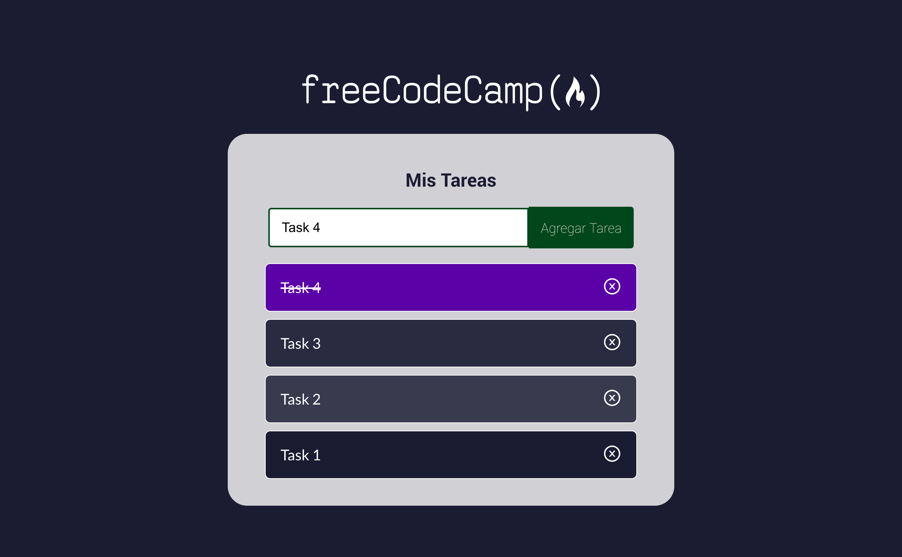

# :desktop_computer: React Exercise III

## Table of Contents

1. [General Info](#generalInfo)
2. [Installation](#installation)

## General Info

This project is a practice from Free Code Camp, to learn how to build a task manager width React.

### Screenshot

## Installation :desktop_computer: :electric_plug:

- Open your Visual code and a new terminal
- git clone https://github.com/Crisktina/gestor-tareas

### `npm start`

Runs the app in the development mode.\
Open [http://localhost:3000](http://localhost:3000) to view it in your browser.

The page will reload when you make changes.\
You may also see any lint errors in the console.
